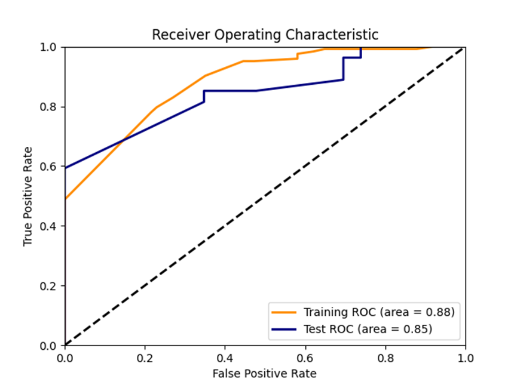
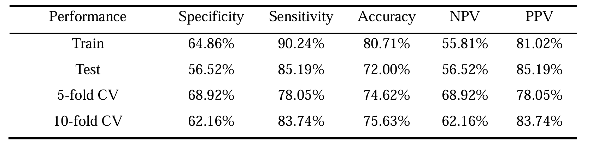
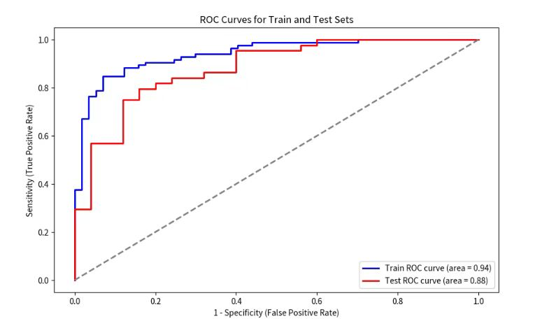
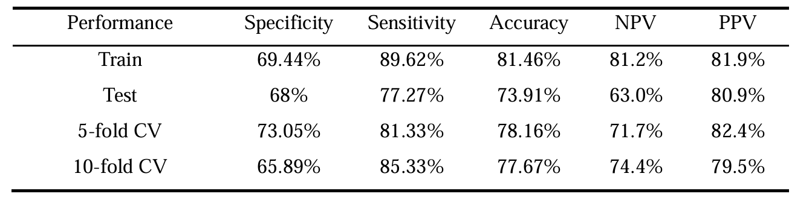
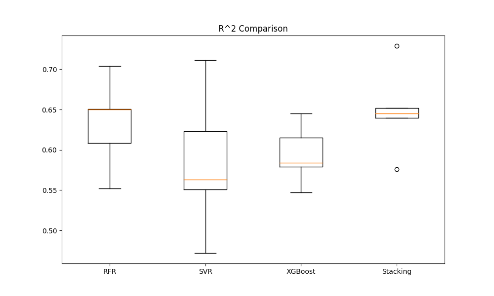
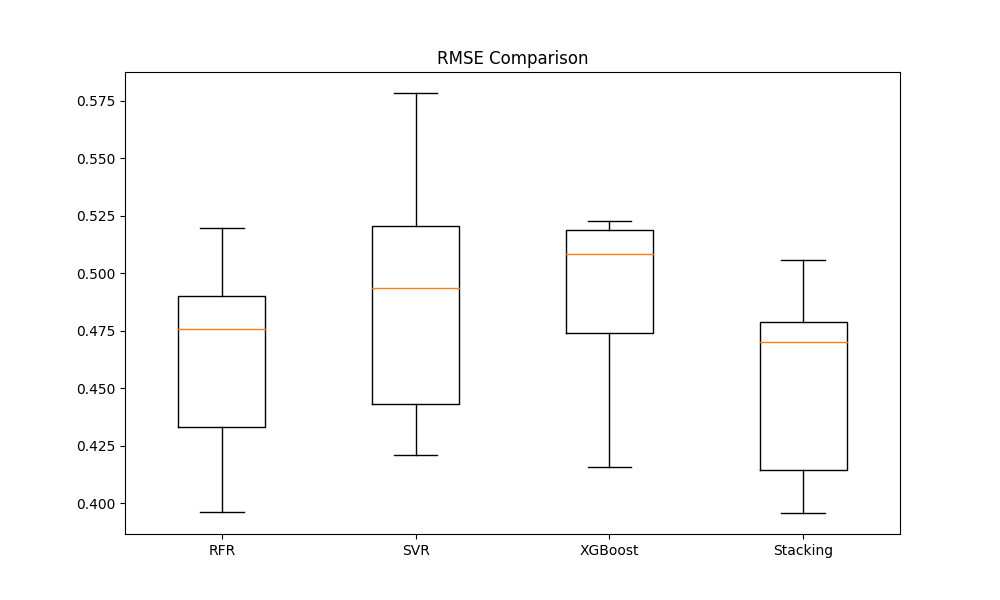
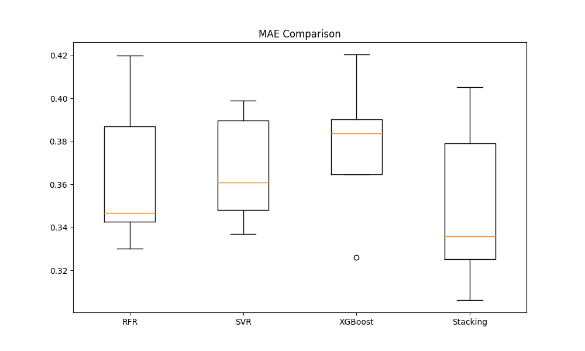

# 
华法林敏感性判别和剂量预测模型
## 
<b><a href="[README.md](README.md)">English</a> | <a href=[READMEzh.md](READMEzh.md)>简体中文</a></b>

#### 作者：魏智健 (南京农业大学) ，如果有任何问题，请随时联系我``18151936092@163.com``📧
 **数据集与临床药学高度相关，原始数据的指标对非专业人士来说可能鸡同鸭讲，但是仅用来实战机器学习不需要完全看懂。如果感兴趣的人多的话，我会进一步完善READ.ME。 
   如果这套算法对你有帮助，可以给本项目一个 Star ⭐ ，或者推荐给你的朋友们，谢谢！😊**

##  💻简介
##### 这是南京某医院的一个真实项目，包含了分类任务和回归任务。原数据是二百多位病人对华法林的各项身体指标和用药剂量统计表（已归一化处理）。本项目的任务是进行数据清洗和分析，遴选出最佳机器学习模型进行建模和验证，并与不同集成方式的模型进行比较，最终构建最优的华法林敏感性判别模型和华法林用药剂量模型

* **华法林敏感性判别模型**: 朴素贝叶斯、逻辑回归
    
 * **药物剂量预测模型**:RFR、SVR、XGBoost、Stacking（SOTA）
 

 

## ⚡数据说明

包含了247名机械心脏瓣瓣膜术后患者的各项指标和平均华法林用量（已归一化处理）

    1204all.xlsx

将与敏感性相关的指标单独提取出来的数据（已归一化处理）,此表格可直接用于进行药物敏感性分析模型建模

    normalized_data.xlsx
   
此脚本可用于SHAP值计算和出图展示（示例中基于RFR）

    SHAP_mapping(RF).py

## 👀结果展示

### * **朴素贝叶斯华法林敏感性分析模型**：

### * **逻辑回归华法林敏感性分析模型**：

   

   

### * **华法林药物剂量预测模型**：
不同变量的SHAP值分布：

  
 
 
不同模型的预评价精度比较（模型的选择和调参已省略）

   

